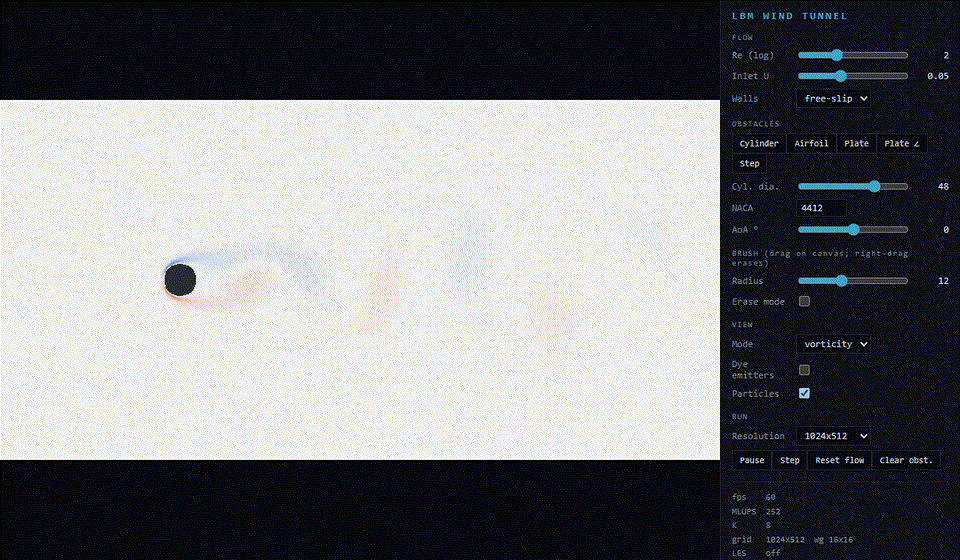

# WebGPU LBM Wind Tunnel

A real-time 2D computational wind tunnel running a D2Q9 lattice Boltzmann solver entirely on WebGPU. Draw obstacles or select a cylinder, NACA 4-digit airfoil, plate, or backward-facing step and inspect velocity, vorticity, pressure, smoke, particle paths, and momentum-exchange forces live.



## Quick start

Requirements: Node.js 24+ and a browser with WebGPU enabled.

```bash
npm install
npm run dev
```

Chrome/Edge stable and Safari 18+ expose WebGPU by default on supported hardware. Firefox currently requires `dom.webgpu.enabled`. The app presents an explanatory fallback when WebGPU is unavailable.

## Controls

- **Re / Inlet U:** Reynolds number is the primary flow control; inlet speed remains in the low-Mach interval 0.02–0.1.
- **Walls:** free-slip open-tunnel walls or periodic top/bottom boundaries.
- **Obstacles:** cylinder, NACA 4-digit airfoil with angle of attack, normal/inclined plates, and backward-facing step.
- **Brush:** left/touch drag paints solid cells; right drag or erase mode removes them.
- **Views:** velocity magnitude, vorticity, density/pressure, and dye/smoke. About 20,000 optional particles use RK2 advection.
- **Resolution:** 512×256, 1024×512, or 2048×1024. Unsupported modes are disabled after checking the device's storage-buffer limits. A change reloads the simulation and reallocates all GPU resources once.
- **Run:** pause, single-step, reset flow, or clear obstacles.

The HUD reports FPS, MLUPS, adaptive solver substeps K, lattice/workgroup size, LES status, Re, relaxation time, frontal height, coefficient reference length, Cd, Cl, St, and total steps.

## Physics and numerics

The solver uses the D2Q9 BGK lattice Boltzmann method with a fused pull-scheme stream/collide kernel. Halfway bounce-back handles obstacles, a regularized Zou–He condition prescribes the west inlet, zero-gradient populations leave at the east outlet, and top/bottom walls default to free-slip.

The user-facing Reynolds number controls viscosity through

```text
nu  = (tau - 0.5) / 3
Re  = U D / nu
tau = 0.5 + 3 U D / Re
```

`tau` is always clamped to [0.51, 1.5]. Above Re≈2000, the app automatically enables a local Smagorinsky LES model (`Cs=0.1`):

```text
Pi_ab    = sum_i c_i,a c_i,b (f_i - f_i_eq)
tau_turb = 0.5 [sqrt(tau^2 + 18 Cs^2 |Pi| / rho) - tau]
tau_eff  = clamp(tau + tau_turb, 0.51, 1.5)
```

No extra LES buffers or neighbor reads are required. A low-frequency GPU sentinel detects non-finite density, pauses the simulation, reports the failure, and paints unstable cells magenta.

### Airfoil Reynolds-number equivalence

The UI retains frontal-height Reynolds number `Re_D`, because that convention also works for cylinders, plates, and arbitrary brush geometry. Airfoil literature normally reports chord Reynolds number `Re_c`. Both describe the same flow when they use the same inlet velocity and viscosity:

```text
nu   = (tau - 0.5) / 3
Re_D = U D / nu = 3 U D / (tau - 0.5)
Re_c = U c / nu = 3 U c / (tau - 0.5)

Re_c = Re_D (c / D)
Re_D = Re_c (D / c)
```

Here `D` is the obstacle's frontal height after rotation and `c` is the airfoil chord. Consequently, changing angle of attack changes `D` and the UI value needed to reproduce a fixed `Re_c`, even though the chord remains constant.

The stability clamp determines the Reynolds number actually realized by the solver:

```text
tau_requested = 0.5 + 3 U D / Re_D_requested
tau_actual    = clamp(tau_requested, 0.51, 1.5)
Re_D_eff      = 3 U D / (tau_actual - 0.5)
Re_c_eff      = Re_D_eff (c / D)

Re_D_max = 3 U D / (tau_min - 0.5)
Re_c_max = 3 U c / (tau_min - 0.5)
```

Always use the HUD's effective Reynolds number when the request is clamped. Smagorinsky LES adds local eddy viscosity for robustness; it does not increase the molecular Reynolds number represented by a clamped `tau`.

Drag/lift normalization is a separate conversion. If coefficients normalized by frontal height must be converted to the airfoil convention:

```text
Cd_c = Cd_D (D / c)
Cl_c = Cl_D (D / c)
```

The app already performs this normalization: NACA presets report `Cd` and `Cl` using chord `c`, while other obstacles use frontal height `D`. The HUD identifies the active `Lref`.

Worked example for the 2048x1024 NACA 0012 preset at 0 degrees:

```text
c = 389 cells, D = 47 cells, U = 0.09, requested Re_D = 1259
Re_c = 1259 (389 / 47) = 10420
nu = 0.09 (47) / 1259 = 0.00336
tau = 0.5 + 3 nu = 0.51008
Re_c_max at tau_min = 0.51 is approximately 10503
```

This request is therefore a genuine chord-Reynolds-number case near `Re_c = 10000`, not the lower effective-Re case produced when `U = 0.05` reaches the `tau = 0.51` clamp.

## GPU architecture

- Two f32 distribution buffers, each `9 × Nx × Ny`, ping-ponged without per-frame bind-group creation.
- One 2D compute dispatch per LBM substep; workgroup dimensions are WGSL pipeline overrides.
- Startup benchmark compares 8×8, 16×16, and 16×8 using `queue.onSubmittedWorkDone()` so timing includes completed GPU work rather than command-encoding time.
- Adaptive K uses both rAF frame time and asynchronously measured queue-drain latency, with hysteresis over 45-frame windows.
- Reset and inlet-speed changes use a 1200-lattice-step smooth ramp instead of launching an impulsive pressure pulse.
- Smooth absorbing fringes cover the final 16% of the outlet and outer 8% of free-slip walls. They relax weakly toward undisturbed equilibrium so pressure waves leave without damping the obstacle/wake core; periodic-Y runs disable wall damping.
- Forces use exact two-stage reduction: workgroup shared sums → per-workgroup partials → one final reduction. Force readback is asynchronous every ten frames.
- Dye, particles, force reduction, rendering, and stability checks remain GPU-side; no steady-state frame blocks on a readback.

## Validation

The quantitative procedure and caveats are recorded in [VALIDATION.md](VALIDATION.md).

| Gate                            |                  Result | Status |
| ------------------------------- | ----------------------: | :----: |
| Periodic-box mass conservation  |           error < 1e-10 |  Pass  |
| Poiseuille centerline profile   |              < 1% error |  Pass  |
| CPU/GPU fields after 500 steps  |        max error < 1e-4 |  Pass  |
| Cylinder Re=20, blockage 1/21   |               Cd = 2.18 |  Pass  |
| Cylinder Re=100, blockage 1/21  |              St = 0.167 |  Pass  |
| 1024×512, fixed K=3             |        60 fps, 94 MLUPS |  Pass  |
| Re≈5000 NACA 4412, AoA 10°, LES | finite; rho 0.990–1.005 |  Pass  |
| 2048×1024 allocation/run        |  60 fps at adaptive K=8 |  Pass  |

Force coefficients use `C = 2F/(rho U² Lref)`. For NACA airfoils, **Lref is chord**; cylinders and arbitrary obstacles retain frontal-height normalization. The HUD reports both frontal `D` and `Lref`, so the active convention is explicit. Reynolds numbers in this simulator remain in the low-to-moderate lattice regime and should still not be compared directly with high-Re experimental polar data without matching Reynolds number, blockage, and boundary conditions.

### Airfoil validation method

Use the following procedure for a reproducible low-Reynolds-number airfoil comparison:

1. Select NACA 0012, set angle of attack to 0 degrees, and use the highest practical resolution. Record `Nx x Ny`, chord `c`, frontal height `D`, `U`, wall mode, LES status, and blockage `D/Ny`.
2. Choose the literature chord Reynolds number and enter `Re_D = Re_c (D/c)`. Increase `U` if necessary while keeping `U <= 0.1`, then verify that the HUD's effective `Re_D` equals the requested value. Reject a run that represents a lower effective Reynolds number.
3. Reset the flow after every parameter change. Let the initial transient leave the domain and continue until two consecutive force-sample windows give mean `Cd` values within 1%. For a symmetric NACA 0012 at 0 degrees, time-mean `Cl` should also approach zero.
4. Compare time-mean, chord-normalized `Cd`--not an instantaneous chart sample--at matching `Re_c` and angle of attack. Record `tau`, total lattice steps, averaging interval, and whether the solution is steady or periodic.
5. Repeat at a second chord resolution before claiming grid independence. Also check sensitivity to blockage and inlet Mach number; agreement at one grid is validation evidence, but not a formal discretization-error estimate.

Current manual 2048x1024 NACA 0012 results at 0 degrees are:

| Chord Reynolds number | Measured mean Cd | Validation Cd | Note                                               |
| --------------------: | ---------------: | ------------: | -------------------------------------------------- |
|   approximately 1,000 |            0.122 |         0.119 | chord normalized, converged over a 7-minute run    |
|                 2,000 |            0.088 |         0.084 | chord-normalized                                   |
|                 5,000 |            0.055 |         0.052 | chord-normalized                                   |
|  approximately 10,400 |            0.040 |         0.037 | `Re_D=1259`, `U=0.09`, `tau` approximately 0.51008 |

The primary reference is Di Ilio et al., ["Fluid flow around NACA 0012 airfoil at low-Reynolds numbers with hybrid lattice Boltzmann method"](https://doi.org/10.1016/j.compfluid.2018.02.014), _Computers & Fluids_ 166 (2018), 200-208; an [open arXiv copy](https://arxiv.org/abs/2006.10487) is available. It studies two-dimensional NACA 0012 flow, includes a grid-convergence assessment, and reports zero-angle cases through `Re_c = 10000`. Values read from plotted curves should be treated as approximate unless the underlying numerical data are digitized.

[XFOIL](https://web.mit.edu/drela/Public/web/xfoil/) is useful as an independent trend check when geometry, `Re_c`, angle, Mach number, and transition settings are matched. It couples an airfoil panel solution to integral boundary-layer equations, whereas this project resolves the two-dimensional flow on a lattice; close agreement is encouraging, but XFOIL is not a substitute for the paper comparison or a grid-convergence test at these very low Reynolds numbers.

The underlying simple outlet/free-slip conditions reflect weak acoustic modes, so the production app adds absorbing fringes. A direct pressure-pulse A/B test reduced reflected core-density RMS by about 97% (`2.94e-4` → `8.32e-6`). Time-mean Cd remains the primary force metric; the Phase 5 Strouhal gate was independently cross-checked against wake velocity zero crossings.

Machine-readable result summaries and their provenance are available in [`validation-data/`](validation-data/). They are suitable for regression baselines and comparisons with other LBM implementations; manually transcribed values are identified explicitly and are not represented as raw time-series output.

## Reuse and citation

This project is released under the [MIT License](LICENSE). If the solver, implementation,
or validation cases help your work, please cite **Budiman Apri Utomo, WebGPU LBM Wind
Tunnel, version 1.0.0**. GitHub can generate citation text directly from
[`CITATION.cff`](CITATION.cff).

- Repository: [BudimanApri/LBM_CPU-GPU](https://github.com/BudimanApri/LBM_CPU-GPU)
- Contact: [budimanapriu999@gmail.com](mailto:budimanapriu999@gmail.com)
- LinkedIn: [Budiman Apri Utomo](https://www.linkedin.com/in/budimanapri/)

## Development commands

```bash
npm test                 # CPU + browser/WebGPU tests
npm run typecheck
npm run lint
npm run build
npm run validate:phase6  # live FPS, LES, and 2048x1024 browser gate
npm run validate:acoustics # Re≈7000/U=0.09/AoA=8 boundary-reflection gate
```

WGSL constants are generated from `src/solver/constants.ts`, the single source of truth for D2Q9 ordering, weights, opposites, and specular partners.
